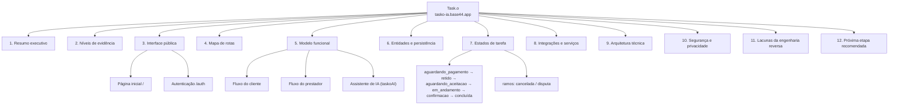
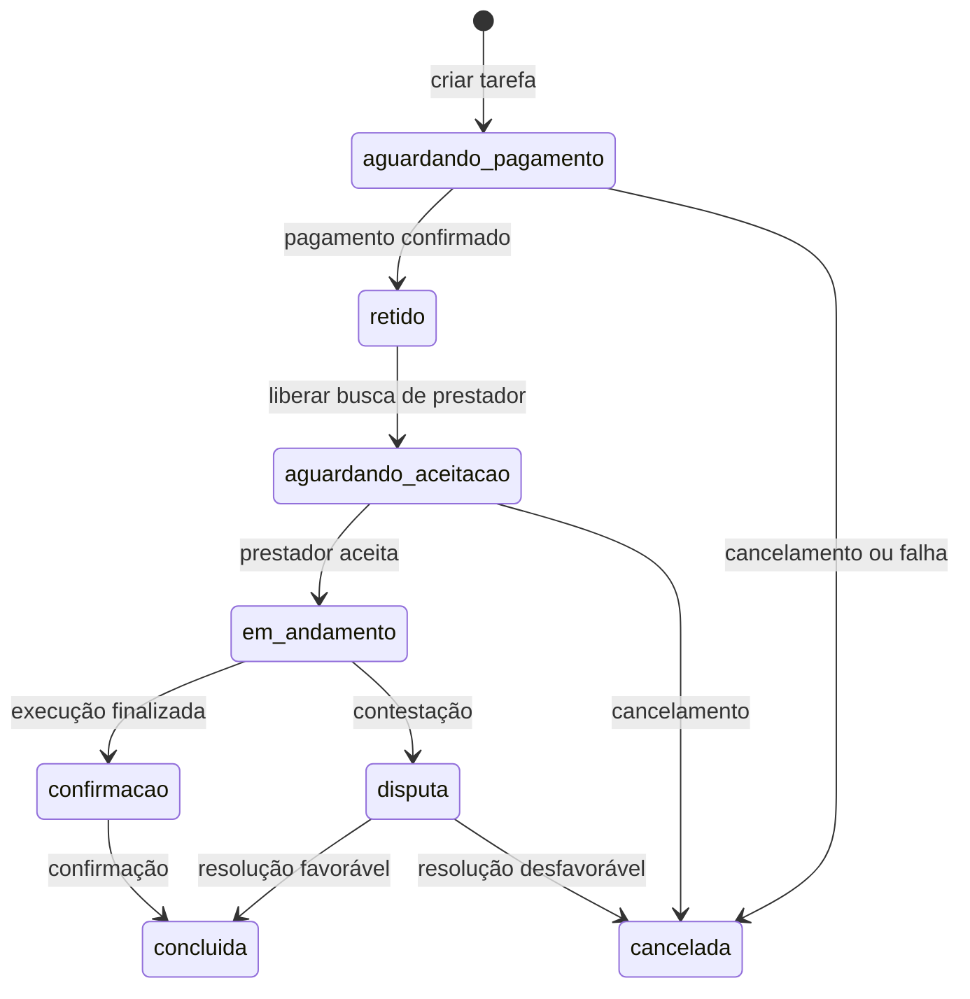
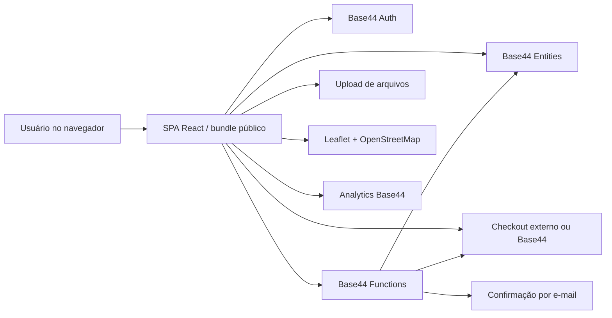

# Mapa mental — Task.o (engenharia reversa)

Reorganização em mapa mental da *Documentação de engenharia reversa — Task.o*
(aplicação `tasko-ia.base44.app`, análise de 17 de setembro de 2026).

**Versão interativa (recomendada):** [Mapa mental Task.o](https://claude.ai/artifact/6Ldp2PkGU2Th4LnVGsxKCp)
— ramos expansíveis, tabelas de rotas/entidades/integrações e filtro por nível
de evidência.

> Escopo original: inspeção somente leitura da aplicação pública, da tela de
> autenticação, do HTML inicial, do manifesto PWA e do bundle JavaScript
> público. Nenhum arquivo, registro, configuração de conta ou dado de usuário
> foi alterado.

## Visão geral

## 1. Resumo executivo

- PWA que se apresenta como marketplace de serviços rápidos: conecta quem
  precisa resolver tarefas urgentes a profissionais verificados na região.
- Três benefícios anunciados: resposta em minutos, cadastro rápido e seguro,
  profissionais avaliados.
- Papéis: **Cliente** (publica/acompanha tarefas), **Prestador** (aceita
  tarefas, acompanha ganhos), **Ambos** (papel combinado), **Admin** (rota
  pública no mapa de títulos).
- Arquitetura observável: SPA React empacotada em JavaScript, hospedada no
  domínio da aplicação e apoiada por serviços Base44 (autenticação, entidades,
  upload, checkout, geolocalização, mensagens, funções).
- A existência dessas chamadas prova intenção funcional — não que cada fluxo
  esteja operacional ou acessível ao usuário anônimo.

## 2. Níveis de evidência

| Nível | Significado |
|---|---|
| **Observado** | Elemento renderizado ou comportamento visível sem autenticação. |
| **Declarado no cliente** | Rota, entidade, função ou integração encontrada nos assets JavaScript públicos. |
| **Inferido** | Interpretação funcional dos dois níveis anteriores; requer validação com sessão autorizada ou código de backend. |

Conteúdo protegido por autenticação, regras de autorização do servidor,
esquemas completos das entidades, segredos e implementação server-side **não
foram acessados**.

## 3. Interface pública observada

### 3.1 Página inicial (`/`)

Identidade visual escura, fundo estrelado, tons de azul-marinho, amarelo e
laranja. Nome exibido como "TaskO" ou "Task.o" conforme o contexto do HTML.

- "Serviços rápidos com profissionais verificados"
- "Resposta em minutos — prestadores disponíveis agora mesmo na sua região"
- "Cadastro rápido e seguro — crie sua conta em poucos passos, sem burocracia"
- "Profissionais avaliados — sistema de avaliações e níveis de confiabilidade"
- "Entrar ou Criar conta" + aviso de Termos de Uso e Política de Privacidade
- Alternador de tema visual
- Badge "Edit with Base44" (elemento de plataforma, não do fluxo de negócio)

### 3.2 Autenticação (`/auth`)

Aberta sem preencher ou enviar dados. Exibe: botão Voltar, marca TaskO,
título "Bem-vindo de volta", subtítulo "Entre na sua conta", campos de
e-mail e senha, controle de visibilidade da senha, botão "Entrar" e link
"Criar agora".

O bundle também declara: login por e-mail/senha, cadastro, verificação de
OTP, reenvio de OTP, logout, consulta do usuário atual, atualização de
perfil e redirecionamento para login. **Nenhuma credencial ou formulário foi
testado.**

## 4. Mapa de rotas

Rotas com/sem hífen parecem ser aliases de compatibilidade. Parâmetros
observados: `taskId` (pagamento, chat, disputa) e `id` (detalhe,
rastreamento, avaliação).

| Rota | Título | Acesso provável |
|---|---|---|
| `/` | Task.o | Público |
| `/welcome` | Welcome | Público ou pré-autenticação |
| `/auth` | Auth | Público |
| `/about` | About | Público |
| `/contact` | Contact | Público |
| `/assistant` | Assistant | Provavelmente autenticado |
| `/roadmap` | Roadmap | Público ou interno |
| `/home` | Task.o | Autenticado |
| `/profile` | Profile | Autenticado |
| `/createtask`, `/create-task` | Create Task | Cliente autenticado |
| `/payment` | Payment | Cliente, após criar tarefa |
| `/tasks` | Tasks | Cliente e/ou prestador |
| `/available-tasks`, `/availabletasks` | Available Tasks | Prestador autenticado |
| `/taskdetail`, `/task-detail` | Task Detail | Usuário relacionado à tarefa |
| `/chat` | Chat | Usuários relacionados à tarefa |
| `/review` | Review | Relacionado à tarefa concluída |
| `/notifications` | Notifications | Autenticado |
| `/wallet` | Wallet | Autenticado |
| `/earnings` | Earnings | Prestador |
| `/livetracking`, `/live-tracking` | Live Tracking | Relacionado à tarefa |
| `/dispute` | Dispute | Relacionado à tarefa |
| `/report` | Report | Autenticado ou moderador |
| `/support` | Support | Autenticado ou público |
| `/admin` | Admin | Administrador |

## 5. Modelo funcional reconstruído

### 5.1 Fluxo do cliente

1. Visitante acessa a página inicial.
2. Cria conta ou entra com e-mail e senha.
3. Abre "Criar tarefa".
4. Informa categoria, descrição, localização, preço e fotos.
5. Sistema sugere preço e exibe taxa TaskO de 15%.
6. Tarefa criada com estado inicial de espera de pagamento.
7. Cliente é direcionado à tela de pagamento.
8. Após confirmação, a tarefa passa a buscar prestadores.
9. Prestadores elegíveis são notificados.
10. Cliente acompanha detalhe, chat e rastreamento ao vivo.
11. Após conclusão, cliente pode registrar avaliação.

O bundle calcula explicitamente `price * 0.15` como "Taxa TaskO (15%)" e
exibe "Tarefa criada! Aguardando pagamento." A retenção do pagamento até a
conclusão é sugerida, mas precisa ser confirmada no backend.

### 5.2 Fluxo do prestador

1. Entra com conta do tipo prestador ou ambos.
2. Sistema consulta usuários online, filtra por cidade e habilidades.
3. Prestador consulta tarefas em `aguardando_aceitacao`.
4. Aceita uma tarefa compatível.
5. Tarefa passa por execução, confirmação e conclusão.
6. Prestador visualiza ganhos, carteira e retiradas.
7. Cliente e prestador trocam mensagens e avaliam a execução.

Atributos usados na busca: `city`, `category`, `skills`, `is_online`,
`skill_levels`. Proximidade indicada por geolocalização do navegador e
cálculo de distância.

### 5.3 Assistente de IA

Função server-side `taskoAI` aparece no bundle e a rota `/assistant` é
declarada — indício de assistente integrado. Hipótese plausível: auxiliar
na descrição ou categorização de tarefas, a validar com sessão autorizada.

## 6. Entidades e persistência declaradas

| Entidade | Papel funcional provável |
|---|---|
| `User` | Identidade, papel, perfil, cidade, habilidades, presença online, níveis de habilidade |
| `Task` | Tarefa publicada, preço, localização, fotos, cliente, prestador, estado |
| `TaskAlert` | Notificação de tarefa para prestadores elegíveis |
| `Message` | Mensagens entre participantes de uma tarefa |
| `Review` | Avaliação e comentário após a execução |
| `Transaction` | Registros financeiros de pagamento, taxa ou repasse |
| `WithdrawRequest` | Solicitações de retirada do prestador |
| `Dispute` | Contestação ou problema associado a uma tarefa |
| `Report` | Denúncia ou relatório de conteúdo, usuário ou incidente |
| `Notification` | Notificações gerais do sistema |
| `ActivityLog` | Registro de atividades |
| `LocationLog` | Histórico ou eventos de localização |
| `FraudAlert` | Sinalização de possível fraude |

Campos observados em chamadas do cliente: `client_id`, `client_name`,
`provider_id`, `provider_name`, `task_id`, `task_title`, `task_category`,
`task_price`, `city`, `category`, `description`, `price`,
`suggested_price`, `photos`, `status`, `payment_status`, `client_rated`,
`provider_rated`. É um inventário do contrato que o cliente espera consumir
— não o esquema definitivo sem acesso ao backend.

## 7. Estados de tarefa e pagamento

Lista parcial — nomes exatos de todos os estados, transições permitidas e
responsáveis por cada transição não foram validados.

## 8. Integrações e serviços

| Integração | Evidência observada | Uso provável |
|---|---|---|
| Base44 | Bundle, badge, endpoints de config e analytics | Hospedagem, runtime, entidades, autenticação, telemetria |
| Upload de arquivos | `UploadFile` | Fotos de tarefas ou documentos de KYC |
| Checkout | `createCheckoutSession` | Criação de sessão de pagamento |
| KYC | `submitKYCVerification` | Verificação de identidade do prestador |
| CEP | `fetchCep` | Preenchimento/validação de endereço |
| OpenStreetMap / Leaflet | Assets de tiles e ícones | Mapa e localização |
| E-mail | `sendTaskConfirmationEmail` | Confirmação relacionada à tarefa |
| WhatsApp | Link `wa.me` embutido no bundle | Canal externo de contato/suporte |
| Google Fonts | Space Grotesk e Inter | Tipografia visual |

A presença de uma integração no bundle não confirma que ela esteja
habilitada em produção, que o fluxo esteja completo ou que o dado seja
processado de forma segura.

## 9. Arquitetura técnica observável

**Tecnologia inferida:** JSX, hooks e componentes indicam React; sinais de
React Router e um mecanismo de consultas/mutações (tipo React Query);
componentes Radix; animações; Leaflet para mapas; camada de cliente Base44
exposta como `fe`. A minificação impede atribuir versões exatas com
segurança.

**PWA:** `manifest.json`, `display: standalone`, `start_url`, ícones de 192
e 512 px e cores de tema — produto configurado como PWA instalável.
Comportamento offline não verificado.

## 10. Segurança e privacidade — pontos para validar

Itens de validação, **não** vulnerabilidades confirmadas:

- [ ] Autorização server-side por papel em tarefas, carteira, ganhos, disputas e `/admin`.
- [ ] `client_id`, `provider_id` e `taskId` sempre validados no servidor, evitando acesso por enumeração de identificadores.
- [ ] Fotos, documentos de KYC e logs de localização não ficam publicamente acessíveis.
- [ ] Estado de pagamento determinado pelo provedor de pagamento ou webhook confiável, não por parâmetros controlados pelo navegador.
- [ ] Retenção, consentimento e finalidade para localização e telemetria.
- [ ] Proteção de dados pessoais em `User`, `Message`, `LocationLog` e `FraudAlert`.
- [ ] Operações administrativas limitadas e trilhas de auditoria em `ActivityLog`.
- [ ] Rate limiting para login, OTP, chat, upload, denúncias e funções de IA.
- [ ] Remover ou controlar o badge "Edit with Base44" no ambiente de usuários finais, se não intencional.

## 11. Lacunas da engenharia reversa

Não confirmado nesta etapa:

- Esquema de banco e tipos formais de cada entidade.
- Regras de autorização e papéis efetivos.
- Conteúdo e validação das telas autenticadas.
- Provedor de pagamento, moeda efetiva e fluxo de reembolso.
- Estados completos da tarefa e tratamento de exceções.
- Algoritmo de matching por cidade, distância, categoria e habilidade.
- Comportamento do assistente de IA e dados enviados à função `taskoAI`.
- Implementação de chat em tempo real e rastreamento.
- Configuração dos webhooks e e-mails.
- Cobertura de testes, observabilidade e estratégia de deploy.
- Comportamento offline da PWA.
- Conformidade jurídica e política de privacidade efetivamente publicada.

## 12. Próxima etapa recomendada

Inspeção autorizada com conta de teste não produtiva, somente após
aprovação explícita e usando dados sintéticos.

Roteiro mínimo:

1. Criar um cliente e um prestador de teste.
2. Publicar uma tarefa fictícia.
3. Interromper antes de qualquer pagamento real.
4. Observar as transições de estado e as telas de chat, avaliação, disputa
   e carteira.
5. Registrar as requisições sem expor tokens ou dados pessoais.

---

*Fonte: "Documentação de engenharia reversa — Task.o", análise de
17/09/2026. Escopo: inspeção somente leitura da aplicação pública, tela de
autenticação, HTML inicial, manifesto PWA e bundle JavaScript público.
Nenhum arquivo, registro, configuração de conta ou dado de usuário foi
alterado. Este mapa é uma reorganização visual do documento original — não
substitui, nem confirma além do que o texto-fonte já classifica como
observado, declarado ou inferido.*
